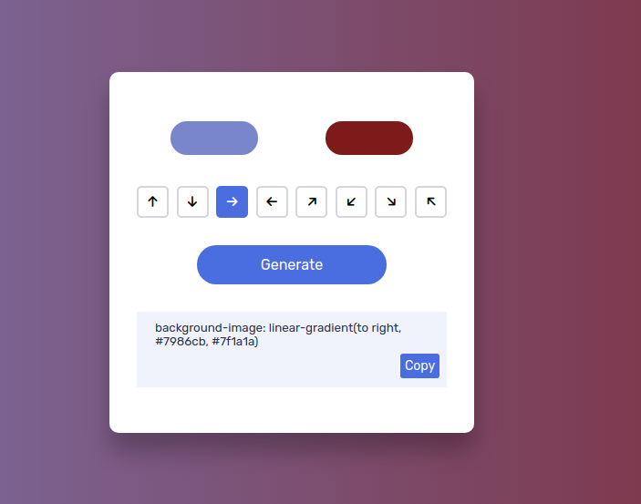

# 🎨 Gradient-Generator 🌈

A simple tool to generate beautiful and attractive gradients for your website! 🚀



🎥 **Live Demo**
Check out the live version of the website: [Gradient Generator](https://gradient-generator-lovat.vercel.app/)


**🛠️ Technologies:**

- HTML5
- CSS3
- JavaScript (ES6+)

## ✨ Features

* Easy-to-use interface 🖱️
* Various gradient options 🌈
* Option to copy the CSS code of the generated gradient 📋
* Fully responsive design 📱

## 📂 File Structure


Gradient-Generator/
├── webfonts/
├── css/
├── index.html
├── index.js
├── README.md
└── screenshot.png

* `webfnts/`: Contains the fonts used for the website.
* `css/`: Contains the stylesheet (CSS) file for the website.
* `index.html`: The main HTML file of the project.
* `index.js`: The main JavaScript file of the project.
* `README.md`: This file containing detailed information about the project.
* `screenshot.png`: A screenshot of the project.


## 🚀 How to Use:

1.  Clone this repository:

    ```bash
    git@github.com:GourangaDasSamrat/Gradient-Generator.git

2.  Navigate to the project directory:
    ```bash
    cd Gradient-Generator
    ```
3.  Open the `index.html` file in your browser.

or

**[Click here](https://gradient-generator-lovat.vercel.app/) to see this project on internet.**

## 👏 Contributing

Contributions are welcome! If you have any ideas for improvements or bug fixes, please open an issue or submit a pull request.

## 📰 License

This project is licensed under the [MIT License](https://opensource.org/licenses/MIT).

## 🖋️ Author

Gouranga Das Samrat

- 📘 [Facebook](https://www.facebook.com/gourangadassamrat)
- 🐦 [Twitter](https://x.com/gouranga_khulna)
- 🎬 [YouTube Channel](https://www.youtube.com/@GourangaDasSamrat)
- 💼 [LinkedIn](https://linkedin.com/in/gouranga-das-samrat)
- 💻 [Code Pen](https://codepen.io/gouranga-das-samrat)
- 🚀 [Leetcode](https://leetcode.com/u/cqq98g0hw0/)
- 🎨 [Protfolio](https://gourangadas.netlify.app/)
- ✍️ [Bloger](https://gourangadassamrat.blogspot.com/)
- 🐙 [Github](https://github.com/GourangaDasSamrat)

---

## 🌟 Show Your Support

If you like this project, please give it a ⭐ on GitHub!

---

## 📢 Feedback

Have suggestions or want to contribute? Feel free to open an issue or reach out to me through my social profiles.

**Happy Programming!**
